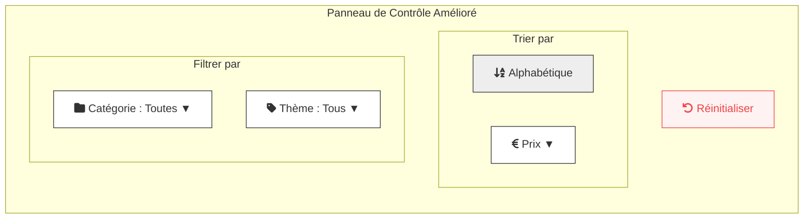

# Plan d'Amélioration du Design et de l'Ergonomie de la Section de Tri

Ce document décrit le plan d'action pour la refonte du composant de tri et de filtrage des articles.

## 1. Analyse et Objectifs

*   **État Actuel :** Le composant `SortControls` est fonctionnel mais visuellement simple, avec une liste verticale d'options.
*   **Objectifs :**
    1.  **Clarté :** Mieux séparer les options de **tri** (ordonnancement) des options de **filtre** (sélection).
    2.  **Ergonomie :** Rendre la sélection plus rapide et fournir un retour visuel immédiat sur les filtres actifs.
    3.  **Design :** Moderniser l'apparence pour qu'elle soit plus cohérente avec le reste du site.

## 2. Propositions d'Améliorations

*   **Structure :**
    *   Diviser le panneau en deux sections claires : **"Trier par"** et **"Filtrer par"**.
    *   Utiliser des icônes (`lucide-react`) pour chaque option afin d'améliorer la reconnaissance visuelle.
*   **Interaction :**
    *   Les boutons de filtre afficheront la sélection actuelle (ex: "Catégorie : Livres") pour un retour immédiat.
    *   Ajouter des animations subtiles à l'ouverture des menus déroulants.
    *   Rendre le bouton de réinitialisation plus distinctif.

## 3. Maquette Conceptuelle (Diagramme Mermaid)

## 4. Plan de Mise en Œuvre Technique

1.  **Mise à jour de `SortControls.tsx` :**
    *   Réorganiser le JSX pour créer les sections "Trier par" et "Filtrer par".
    *   Intégrer des icônes de `lucide-react`.
    *   Modifier le style des boutons et menus avec Tailwind CSS.
    *   Ajouter des transitions CSS pour les animations.
2.  **Logique d'état :** La logique existante sera conservée, il faudra simplement s'assurer que le bouton de réinitialisation fonctionne correctement avec la nouvelle structure.